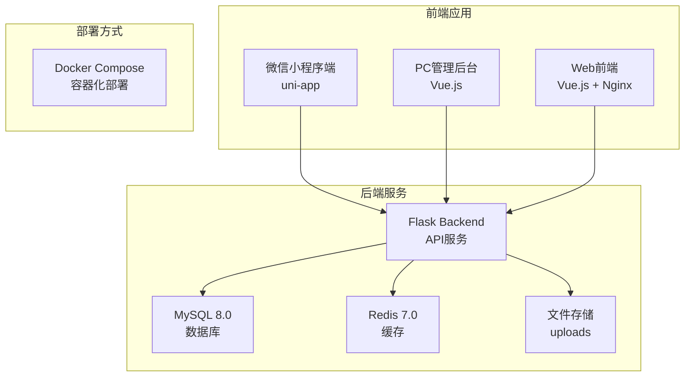

# 心理健康平台 🧠💚

<div align="center">

[](LICENSE)
[](https://python.org)
[](https://vuejs.org)
[](https://flask.palletsprojects.com)
[](https://docker.com)

一个现代化的心理健康服务平台，提供专业的心理咨询、课程学习和心理测评服务

</div>

## 📖 项目概述

心理健康平台是一个全栈的心理健康服务系统，致力于为用户提供便捷、专业的心理健康服务。平台采用现代化的技术栈，提供多端应用支持。

### 🎯 核心特性

- 🔐 **完善的用户认证系统** - 基于JWT的安全认证
- 👨‍⚕️ **专业咨询师管理** - 咨询师信息、排班、预约管理
- 📚 **丰富的课程体系** - 课程创建、学习跟踪、收藏功能
- 📊 **心理测评系统** - 多种心理健康评估工具
- 👥 **互动社区功能** - 群组管理、用户互动
- 💰 **完整的订单支付** - 订单管理、支付集成
- 🏢 **工作室管理** - 线下工作室信息管理
- 📱 **多端适配** - 微信小程序、PC管理后台

## 🏗️ 系统架构



## 📁 项目结构

```
psychological-health/
├── apps/                    # 应用目录
│   ├── backend/            # Flask后端应用
│   │   ├── api/           # API路由
│   │   ├── models/        # 数据模型
│   │   ├── form/          # 表单验证
│   │   ├── middleware/    # 中间件
│   │   ├── utils/         # 工具函数
│   │   ├── static/        # 静态文件
│   │   ├── Dockerfile     # 后端Docker配置
│   │   └── requirements.txt # Python依赖
│   ├── frontend/          # 微信小程序端 (uni-app)
│   │   ├── src/           # 源代码
│   │   ├── pages/         # 页面文件
│   │   ├── components/    # 组件文件
│   │   └── package.json   # 小程序依赖
│   └── web/               # PC管理后台 (Vue.js)
│       ├── src/           # 源代码
│       ├── views/         # 视图组件
│       ├── components/    # 公共组件
│       ├── Dockerfile     # 前端Docker配置
│       ├── nginx.conf     # Nginx配置
│       └── package.json   # 前端依赖
├── mysql/                  # MySQL数据库配置
│   ├── init/              # 数据库初始化脚本
│   │   └── 01-init.sql    # 初始化SQL
│   ├── my.cnf             # MySQL配置文件
│   └── README.md          # MySQL使用说明
├── config/                 # 配置文件
│   └── config.yaml        # 主配置文件
├── docs/                   # 项目文档
├── scripts/                # 脚本文件
├── docker-compose.yml      # Docker编排配置
├── .gitignore             # Git忽略文件
└── README.md              # 项目说明文档
```

## 🚀 技术栈

### 后端技术
- **Python 3.8+** - 主要编程语言
- **Flask 2.x** - Web框架
- **SQLAlchemy** - ORM框架
- **MySQL 8.0** - 主数据库
- **Redis 7.0** - 缓存数据库
- **JWT** - 身份认证
- **WTForms** - 表单验证
- **Flask-CORS** - 跨域处理
- **Gunicorn** - WSGI服务器

### 前端技术
- **Vue.js 3.x** - 渐进式JavaScript框架
- **Vue Composition API** - 现代Vue开发方式
- **Ant Design Vue** - UI组件库
- **SCSS** - CSS预处理器
- **Vite** - 构建工具
- **Axios** - HTTP客户端

### 微信小程序
- **原生小程序开发** - 基于微信开发者工具
- **uni-app** - 跨平台开发框架

### 开发工具
- **Docker** - 容器化部署
- **Docker Compose** - 多服务编排
- **pnpm** - 包管理工具
- **ESLint** - 代码检查
- **Git** - 版本控制

## 🛠️ 快速开始

### 🚀 一键部署（推荐）

如果你只想快速体验项目，使用Docker一键部署：

```bash
# 克隆项目
git clone https://github.com/your-username/psychological-health.git
cd psychological-health

# 一键启动所有服务
docker-compose up -d

# 访问 http://localhost 即可使用
```

### 环境要求

#### Docker部署（推荐）
- Docker 20.10+
- Docker Compose 2.0+
- 至少 2GB 可用内存
- 至少 10GB 可用磁盘空间

#### 本地开发
- Python 3.8+
- Node.js 16+
- MySQL 5.7+
- Redis 6.0+
- pnpm 8.0+

### 1. 克隆项目

```bash
git clone https://github.com/your-username/psychological-health.git
cd psychological-health
```

### 2. 后端设置

```bash
# 进入后端目录
cd apps/backend

# 创建虚拟环境
python -m venv venv

# 激活虚拟环境
# Windows
venv\Scripts\activate
# macOS/Linux
source venv/bin/activate

# 安装依赖
pip install -r requirements.txt

# 配置数据库
# 复制并编辑配置文件
cp config.yaml.example config.yaml
# 编辑 config.yaml 中的数据库连接信息

# 初始化数据库
python app.py init-db

# 启动后端服务
python app.py
```

### 3. PC管理后台设置

```bash
# 进入web目录
cd apps/web

# 安装依赖
pnpm install

# 启动开发服务器
pnpm dev
```

### 4. 微信小程序设置

```bash
# 进入frontend目录
cd apps/frontend

# 安装依赖
pnpm install

# 启动开发服务器
pnpm dev
```

### 5. 使用Docker（推荐）

```bash
# 一键部署所有服务
docker-compose up -d

# 查看服务状态
docker-compose ps

# 查看日志
docker-compose logs -f

# 停止服务
docker-compose down

# 重新构建并启动
docker-compose up -d --build
```

## 🔧 配置说明

### 后端配置 (config.yaml)

```yaml
# 数据库配置
database:
  host: localhost
  port: 3306
  user: root
  password: your_password
  name: psychological_health

# Redis配置
redis:
  host: localhost
  port: 6379
  password: ""
  db: 0

# JWT配置
jwt:
  secret_key: your_secret_key
  expire_hours: 24

# 文件上传配置
upload:
  max_size: 10MB
  allowed_types: [jpg, jpeg, png, gif]
  path: static/uploads
```

### 前端配置

```javascript
// apps/web/src/utils/config.js
export const API_BASE_URL = 'http://localhost:5000/api'
export const UPLOAD_URL = 'http://localhost:5000/api/upload'
```

## 📚 核心功能

### 👤 用户管理
- 用户注册/登录
- 角色权限控制
- 个人信息管理
- 密码修改

### 👨‍⚕️ 咨询师管理
- 咨询师信息录入
- 专业资质管理
- 排班时间设置
- 评价统计

### 📅 预约系统
- 在线预约咨询
- 预约时间管理
- 预约状态跟踪
- 取消/重新预约

### 📖 课程系统
- 课程内容管理
- 课程大纲编辑
- 学习进度跟踪
- 课程评价

### 🧮 测评系统
- 心理健康测评
- 测评结果分析
- 历史记录查看
- 报告生成

### 🏢 工作室管理
- 工作室信息
- 环境展示
- 地理位置
- 营业时间

## 📊 API文档

### 认证相关
```http
POST /api/auth/login
POST /api/auth/register
POST /api/auth/logout
GET  /api/auth/profile
```

### 用户管理
```http
GET    /api/users
POST   /api/users
PUT    /api/users/{id}
DELETE /api/users/{id}
PUT    /api/users/{id}/roles
```

### 咨询师管理
```http
GET    /api/counselors
POST   /api/counselors
PUT    /api/counselors/{id}
DELETE /api/counselors/{id}
```

更多API文档请参考：[API文档](./docs/api/README.md)

## 🧪 测试

### 运行后端测试
```bash
cd apps/backend
python -m pytest tests/
```

### 运行前端测试
```bash
cd apps/web
pnpm test
```

## 📦 部署

### 🐳 Docker一键部署（推荐）

```bash
# 1. 克隆项目
git clone https://github.com/your-username/psychological-health.git
cd psychological-health

# 2. 一键启动所有服务
docker-compose up -d

# 3. 查看服务状态
docker-compose ps

# 4. 查看服务日志
docker-compose logs -f
```

**服务访问地址：**
- 🌐 Web前端: http://localhost:80
- 🔧 后端API: http://localhost:5000
- 🗄️ MySQL数据库: localhost:3306
- 🚀 Redis缓存: localhost:6379

### 生产环境部署

1. **构建前端应用**
```bash
cd apps/web
pnpm build
```

2. **配置生产环境**
```bash
# 复制生产配置
cp config/config-prod.yaml apps/backend/config.yaml
```

3. **使用Docker部署**
```bash
docker-compose -f docker-compose.prod.yml up -d
```

### 部署检查清单

- [ ] 数据库配置正确
- [ ] Redis连接正常
- [ ] 环境变量设置
- [ ] SSL证书配置
- [ ] 防火墙端口开放
- [ ] 日志配置
- [ ] 备份策略

## 🔍 故障排除

### 常见问题

**Q: 数据库连接失败**
```bash
# 检查MySQL服务状态
systemctl status mysql

# 检查连接配置
mysql -h localhost -u root -p
```

**Q: 前端API请求失败**
```bash
# 检查后端服务状态
curl http://localhost:5000/api/health

# 检查CORS配置
```

**Q: 文件上传失败**
```bash
# 检查上传目录权限
ls -la apps/backend/static/uploads/

# 检查文件大小限制
```

## 📞 联系我

- 项目维护者：pengcunfu
- 邮箱：3173484026@qq.com
- 问题反馈：[GitHub Issues](https://github.com/pengcunfu/psychological-health/issues)

---

<div align="center">
Made with ❤️ by the Development Team
</div> 
